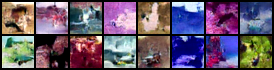
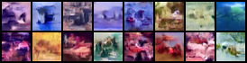
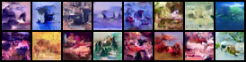
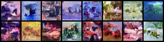
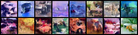
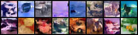
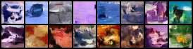
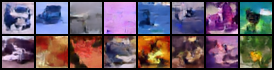

# DDIM — CIFAR10 Diffusion from scratch

A from-scratch PyTorch implementation of DDPM (Ho et al., 2020) and DDIM
(Song et al., 2020). Same noise schedule, same U-Net, same training loss
— two different samplers.

## Files

| File | What it does |
| --- | --- |
| `noise_schedule.py` | Linear β schedule + precomputed constants. `add_noise` (DDPM Eq. 4) and `denoise_one_step` (DDPM Algorithm 2). |
| `unet.py` | The ε-prediction network. Sinusoidal time embedding → residual blocks with time conditioning → self-attention at 16×16 and 4×4 → symmetric up path with skip connections. |
| `train.py` | CIFAR10 training loop (DDPM Algorithm 1). Periodically generates sample grids and saves checkpoints. |
| `sample.py` | DDPM sampling. Markov-chain Algorithm 2 — `T` sequential network calls, stochastic noise injection per step. Includes a progressive-generation mode (paper Fig. 6 style). |
| `ddim_sample.py` | DDIM sampling. Non-Markovian sampler: predicts `x̂_0`, jumps directly across a timestep subsequence. Includes step-count comparison, η sweep, and the consistency experiment. |

## Running it

```bash
# Train (downloads CIFAR10 on first run, ~170 MB to ./data)
PYTORCH_ENABLE_MPS_FALLBACK=1 python train.py

# DDPM sampling (slow, T steps)
python sample.py

# DDIM sampling (fast, configurable step count)
python ddim_sample.py
```

Outputs write to the current directory.

Device detection order: **CUDA → MPS → CPU**. `cudnn.benchmark` and
`pin_memory` only flip on when CUDA is actually available.

## This is a shrunken model — and you can see it in training

The paper's CIFAR10 config is **53.5M parameters** (`base_channels=128`,
`T=1000`, `batch=128`) and trains for ~800k steps on a serious GPU. To
make this runnable on an M4 MacBook Pro, the config in this repo is cut
down significantly:

| | Paper | This repo |
| --- | --- | --- |
| `base_channels` | 128 | **64** |
| Parameters | ~53.5 M | **~13.4 M** |
| `T` (diffusion steps) | 1000 | **500** |
| `BATCH_SIZE` | 128 | **64** |
| Target steps | 800 k | run until Ctrl+C |

**Observed effect on training loss** (M4 MPS, ~2.7 steps/sec, 5 000 steps):

```
Step 100:  0.1328
Step 300:  0.0447   ← fast drop as the model learns the identity-like
Step 500:  0.0657     shortcut for high-t timesteps (where x_t ≈ ε)
Step 1000: 0.0491
Step 2000: 0.0679   ← model enters its actual learning regime,
Step 2400: 0.0330     but the per-batch loss now has enough variance
Step 3000: 0.0384     (~±0.02) that you cannot read a trend off
Step 3700: 0.0340     individual 100-step prints
Step 4700: 0.0369
Step 5000: 0.0464
```

The loss floor is sitting around **0.035–0.05**, where the paper
(full-size model) reaches ~0.02 after extensive training. Two forces are
at work:

- **Capacity limit.** 13.4 M params isn't enough to model fine
  low-noise residuals as well as 53.5 M. You hit the model's floor
  sooner and lower quality caps out earlier.
- **Easier task.** Halving `T` (1000→500) makes the per-step denoising
  jump larger, which is *harder* per step, but the total chain is
  shorter, so cumulative drift is less forgiving — a net wash for loss
  value, but visible in slightly blurrier samples.

### Sample-quality milestones actually observed

With this shrunken config, what the `samples_step_*.png` images look
like:

- **0–2 k steps:** pure Gaussian noise.
- **2 k–10 k steps:** faint color bias, occasional low-frequency blobs.
- **10 k–50 k steps:** distinct color regions, vaguely object-shaped
  blobs if you squint. This is roughly the ceiling for this config on
  an M4 — the model plateaus here.
- **Beyond ~50 k:** diminishing returns. No amount of additional
  training on the shrunken model will reach paper-quality recognizable
  CIFAR10 classes.

For paper-quality samples, you need to flip the config back
(`BASE_CHANNELS=128`, `T=1000`, `BATCH_SIZE=128`) and run on a real
GPU. On an A100 that's ~13 hours for 800k steps; on a 4090 ~18 hours.

## DDIM vs DDPM — what actually differs

**Training is identical.** Both samplers use the *same trained model*,
trained with the *same DDPM loss* (`F.mse_loss(noise, model(x_t, t))`).
DDIM does not need its own training run. The two methods only diverge
at sampling time.

### Sampling step formulas

DDPM's reverse step uses a fixed Markov chain — at every timestep `t`
you take one small step toward `t-1`, with stochastic noise injected:

```
x_{t-1} = (1/√α_t) · (x_t − (β_t / √(1−ᾱ_t)) · ε_θ) + σ_t · z
σ_t = √β_t,    z ~ N(0, I)
```

DDIM rewrites this as a non-Markovian sampler. At each step you (1)
predict the clean image `x̂_0` directly, then (2) re-noise it back to
some target timestep `t_prev` along the deterministic direction:

```
x̂_0       = (x_t − √(1−ᾱ_t) · ε_θ) / √ᾱ_t
σ_t       = η · √( (1−ᾱ_{t_prev}) / (1−ᾱ_t) · (1 − ᾱ_t / ᾱ_{t_prev}) )
direction = √(1 − ᾱ_{t_prev} − σ_t²) · ε_θ
x_{t_prev} = √ᾱ_{t_prev} · x̂_0 + direction + σ_t · z
```

Two consequences fall out of this rewrite:

1. **`t_prev` doesn't have to be `t − 1`.** You can pick any decreasing
   subsequence of timesteps. Sampling in 50 steps instead of `T=500`
   skips 90% of network forwards.
2. **`η` interpolates between the two regimes.** `η=0` zeroes the
   stochastic term and the sampler becomes fully deterministic — same
   `x_T` always produces the same `x_0`. `η=1` reproduces a DDPM-like
   stochastic step.

### Measured speedup on this repo's checkpoint

Same trained model (`checkpoint_step_4000.pt`), 16 samples on M4 MPS,
both samplers calling the *exact same network*:

| Sampler | Steps | Wall-clock | Speedup vs DDPM |
| --- | --- | --- | --- |
| DDIM | 10  | **0.3 s** | **49×** |
| DDIM | 20  | 0.7 s | 25× |
| DDIM | 50  | 1.7 s | 10× |
| DDIM | 100 | 3.4 s | 5× |
| DDPM | 500 | 16.8 s | 1× |

The speedup tracks the step-count ratio almost perfectly because both
samplers do exactly one network forward per step — the only difference
is *how many steps you take*. DDIM lets you spend less compute and
still land near the same image, because at η=0 the sampler is just
deterministically integrating along the same trajectory with a coarser
step size.

A 50-step DDIM sample looks visually similar to the 500-step DDPM
sample on this checkpoint, while finishing in **a tenth of the time**.

| DDPM, 500 steps (16.8 s) | DDIM, 50 steps (1.7 s) |
| --- | --- |
|  |  |

Both grids are 16 samples from the same checkpoint. The DDIM grid is
generated from a fixed `x_T` seed and uses η=0; the DDPM grid uses the
stochastic Markov-chain sampler in `sample.py`.

### The consistency property (DDIM only, η=0)

With η=0, DDIM is a deterministic function of `x_T`. The same starting
noise produces samples with the same high-level structure regardless
of how many timesteps you use — only fine detail changes as the step
count grows. `consistency_experiment` in `ddim_sample.py` writes
`consistency_{10,20,50,100,200}steps.png` from a fixed seed; rows
should look like the same scene at increasing resolution. **DDPM
doesn't have this property** because its per-step stochastic noise
re-randomizes the trajectory.

| 10 steps | 20 steps | 50 steps | 100 steps | 200 steps |
| --- | --- | --- | --- | --- |
|  |  |  |  |  |

### The η sweep

`compare_eta` writes `eta_{0.00,0.25,0.50,0.75,1.00}.png` from a fixed
starting noise. At η=0 the images are locked to the seed; as η grows
they drift further apart. By η=1 you've recovered DDPM-like
stochasticity and the structural correspondence is mostly gone.

| η = 0.00 | η = 0.25 | η = 0.50 | η = 0.75 | η = 1.00 |
| --- | --- | --- | --- | --- |
|  |  |  |  |  |

## What's not implemented yet

- **EMA of weights** (pseudocode hook exists in `train.py`). Adds
  visible quality at no extra training cost.
- **Checkpoint resume** in `train.py` — right now every run starts
  from step 0.
